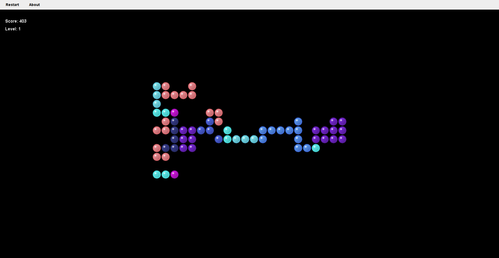

# Bubble Swerve

Welcome to the main repository for **Bubble Swerve**, a dynamic, rotation-based puzzle game.

This repo serves as a central hub for multiple implementations:

- 🎯 [Java Edition (Swing)](https://github.com/yourusername/BubbleSwerve-Java)  
  A lightweight, cross-platform version built with Java and Swing. Requires Java 8+.

- 🧩 [C# Edition (Avalonia)](https://github.com/yourusername/BubbleSwerve-CSharp)  
  Built with Avalonia UI and .NET 7, supporting Windows, Linux, and macOS.

Stay tuned for shared assets, game specs, and platform-specific improvements.

